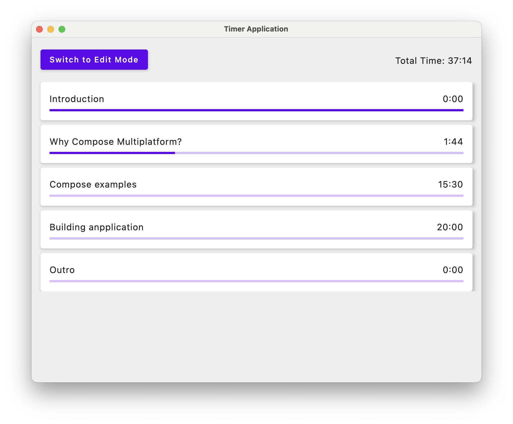

# Presentation Defender
Compose Multiplatform demo application




## Installation

### macOS Users

If you get a security warning when trying to open the application ("app can't be opened because it was not created by an identified developer"), you can still run it by following these steps:

1. In Finder, locate the application (it might be in your Downloads folder or Applications folder)
2. Control-click (or right-click) the application icon
3. Select "Open" from the shortcut menu
4. Click "Open" in the dialog that appears

You only need to do this once. After that, you can open the application normally by double-clicking it.

Alternatively, you can:
1. Open System Settings
2. Go to Privacy & Security
3. Scroll down to Security
4. Click "Open Anyway" next to the message about the blocked application

### Building from Source

If you prefer to build the application yourself:

1. Clone this repository
2. Make sure you have JDK 17 or later installed
3. Run:
   ```bash
   ./gradlew packageDmg    # For macOS
   ./gradlew packageMsi    # For Windows
   ./gradlew packageDeb    # For Linux
   ```
4. Find the built package in `build/compose/binaries/main/`

## Features

- Edit mode: Create and modify timer entries with descriptions and durations
- Play mode: Sequential countdown timers with progress bars
- Save and load timer lists
- Cross-platform support (macOS, Windows, Linux)

## Storage

The application stores your timer lists in:
- macOS: `~/presentation-defender/`
- Windows: `%USERPROFILE%\presentation-defender\`
- Linux: `~/presentation-defender/`

Each list is saved as a plain text file that you can edit manually if needed.
